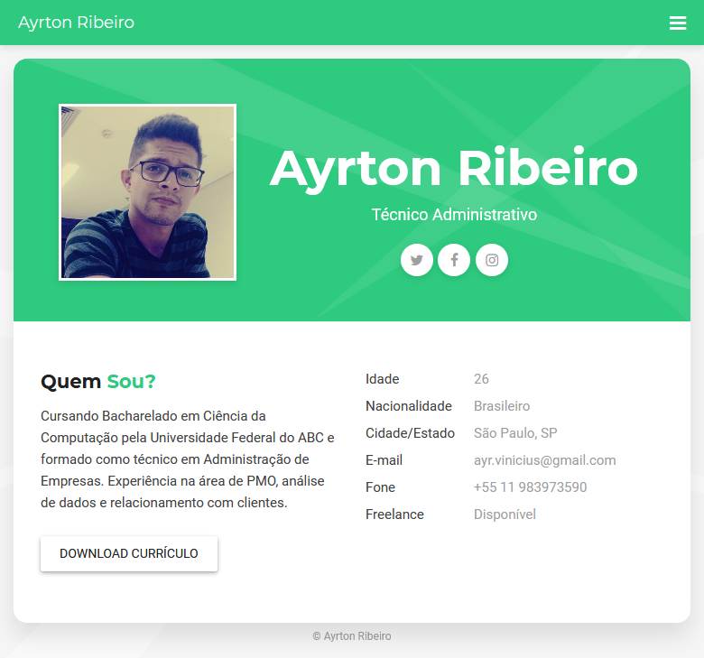

# Nome do Projeto

> Um resumo curto sobre o que o seu projeto faz.

Um ou dois parágrafos sobre o seu projeto e o que ele faz.

Screenshot do projeto:



# Instalação

OS X & Linux
```sh
npm install --save
```
Windows:

```sh
edit autoexec.bat
```

# Exemplos de uso

Alguns exemplos que motivariam as pessoas a utilizarem seu projeto ou que demonstrasse que é útil para alguma coisa. Divida esta parte em partes menores e se possível coloque algum código ou prints de telas.

# Ambiente de Desenvolvimento
 
 Descrever como instalar e preparar qualquer dependência de desenvolvimento para que seu projeto possa ser executado localmante e pessoas possam contribuir com o mesmo. Se possível forneça as informações para diferentes plataformas, exemplo: Windows, Linux e MaC OS.

 # Histórico de Atualizações

 * 0.2.1
    * CHANGE: Atualização dos docs (o código não foi alterado)
* 0.2.0
    * CHANGE: Removido a função
    `setPadrãoXYZ()` 
    * ADD: adicionado a funação `inicializar()`
* 0.1.1
    * FIX: Crash quando executava `escrever()` (Obrigado ao @Contribuidor)
* 0.1.0
    * Primeiro lançamento estável
    * CHANGE: Renomeado de `Projeto XYZ` para `Projeto ABC`
* 0.0.1
    * Projeto inicial

# Meta

Seu nome - [@SeuTwitter](https://twitter.com/seuTwitter) - seuemail@gmail.com
Distribuído sobre a licença. Veja `LICENÇA` para mais informações.
[https://github.com/ayrtonribeiro](https://github.com/ayrtonribeiro)


